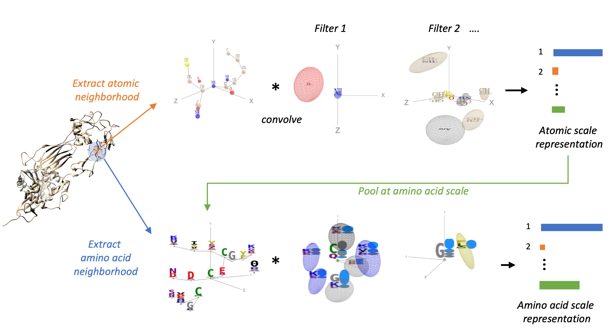
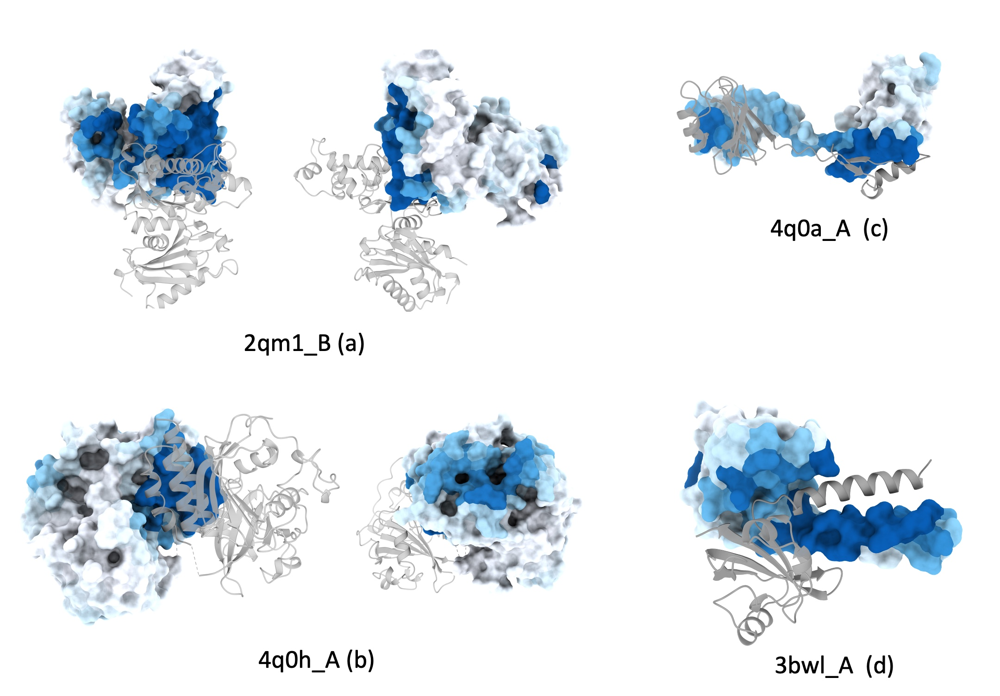
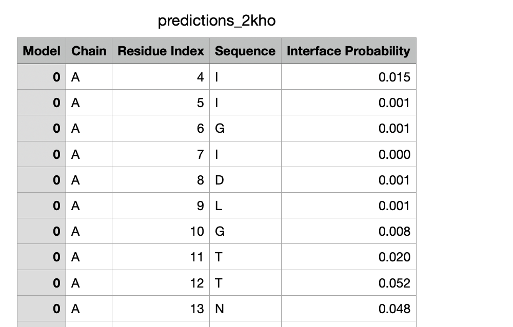
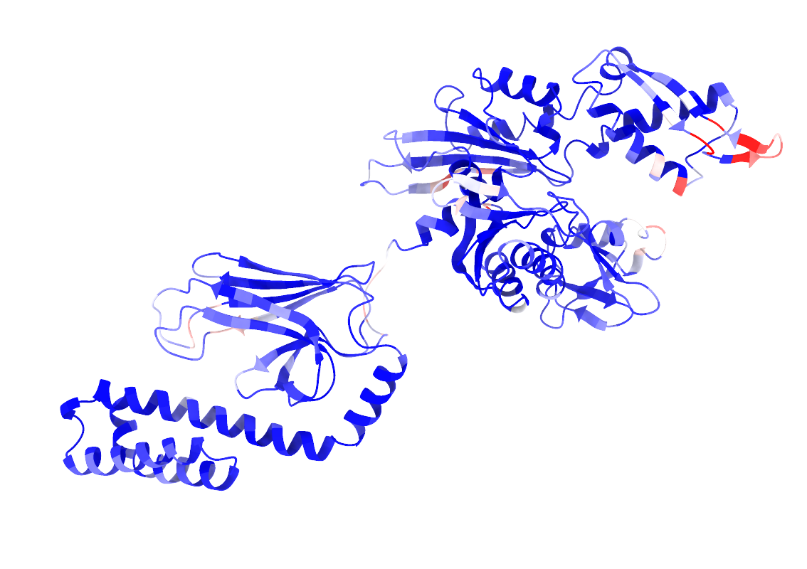
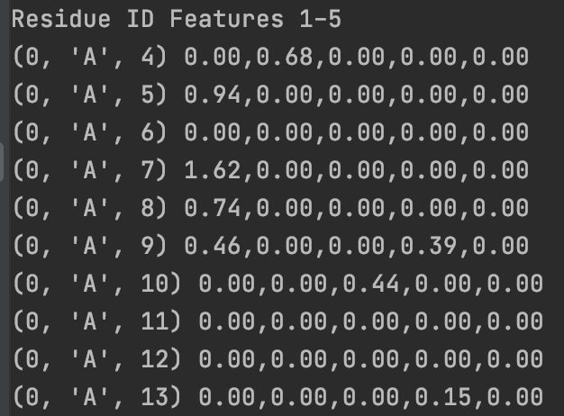

# ScanNet: An interpretable geometric deep learning model for structure-based protein binding site prediction





## Background

Once the three-dimensional structure of a protein has been determined experimentally or predicted in-silico, a central and challenging task of computational structural biology is to identify sites of functional importance such as binding sites of small molecules, proteins or antibodies or sites of post-translational modifications. We introduced for this purpose ScanNet (Spatio-Chemical Arrangement of Neighbors Network) is an interpretable, multi-scale geometric deep learning architecture tailored for protein structures. ScanNet builds representations of atoms and amino acids based on the spatio-chemical arrangement of their neighbors. We trained ScanNet for detecting protein-protein, protein-antibody and protein - intrinsically disordered proteins binding sites and established state-of-the-art performance. The network learns structural motifs of interest directly from raw data; we found that it detects simple, generic structural motifs such as hydrogen bonds or solvent exposed hydrophobic side-chains, whereas others recognize complex, task-specific motifs such as hotspot O-rings or transmembrane helixes. 

## Content

This repository contains codes for training, evaluating and visualizing the ScanNet network.

## Installation
ScanNet is implemented using Python 3.6.12 and various scientific computing packages (numpy, numba, scikit-learn, tensorflow, keras). We recommend creating a dedicated virtual environment and installing the same package versions, see the full list in requirements.txt.   
This can be done in few lines using virtualenv (https://virtualenv.pypa.io/en/latest/index.html) or Anaconda (https://www.anaconda.com):


With Anaconda:
```
conda create -n py_scannet python=3.6.12
conda activate py_scannet
```

With virtualenv:
```
virtualenv -p python3.6.12 /path/to/virtualenvs/py_scannet
source activate
source activate.csh # (for csh shells). 
```

Then:
```
pip install -r requirements.txt
```
 
 If you are using a GPU, 
 
 
No other external software is necessary to run ScanNet.
Paths to the library, MSA & structures folders are defined in utilities/paths.py

Docker images for cpu and gpu execution are also available from DockerHub here: 

```
docker pull scannet
```

```
docker pull scannet-gpu
```


## Predicting binding sites without using evolutionary information

The script for predicting binding sites and visualizing them is predict_bindingsites.py, see some examples:


```
python predict_bindingsites.py 1brs_A --noMSA 
```
*Predict Protein-protein binding sites (PPBS) of barnase*


```
python predict_bindingsites.py P38398 --noMSA
```

*Predict PPBS of human gene BRCA1 (Uniprot ID: P38398) using AlphaFold model.*

```
python predict_bindingsites.py /path/to/6xc2.pdb_A --mode epitope --noMSA
```

*Predict B-cell epitopes of SARS-CoV-2 Receptor Binding Domain*


```
python predict_bindingsites.py 2p6b_AB --assembly --mode idp --noMSA
```

*Predict disordered protein binding sites of Human Calcineurin.*


The first argument is either:
- A PDB ID (e.g. 1brs); the corresponding pdb file is directly downloaded from https://www.rcsb.org
- A Uniprot ID (e.g. P38398); the corresponding AlphaFold model will be downloaded from https://alphafold.ebi.ac.uk
- Path to a local pdb file (e.g. /Users/jerometubiana/PDB/1npm.cif). Both pdb and mmCIF file formats are supported (use either .pdb or .cif extension).

By default, *all* the chains are processed and *independently* from one another. A specific chain or list of chain can be added to the ID with an underscore (e.g. 1brs_A, 2p6b_AB). If the file contains multiple models, the first one is used. To use specific (model,chain) pairs, use e.g. 2p6b_0-A+0-B (first model is indexed 0). To process chains together, use the --assembly option.

Three types of binding sites are currently supported: Protein-protein binding sites (--mode interface, default), B-cell epitopes (--mode epitope), Protein - disordered protein binding sites (--mode idp).

## Visualizing the outputs
Outputs are located in the predictions folder; one subfolder is created for each query. Four output files are produced:

- The PDB file with binding site probabilities inserted in the B-factor field
- A .csv file with the per-residue binding site probabilities.
- A .cxc script for visualizing the results with ChimeraX https://www.rbvi.ucsf.edu/chimerax/ (right click -> open the file with chimeraX).
- A .py script for visualizing the results with Chimera.

Below is an example of outputs obtained by predicting PPBS on the Hsp70 protein in close conformation. 






## Predicting binding sites using evolutionary information

Incorporation of evolutionary information improves substantially performance for predicting protein-protein and protein-disordered binding sites for natural proteins as they are typically more conserved than other surface residues. For designed proteins, incorporation of evolutionary information is not recommended, as conservation does not reflect functionality. For punctual jobs, we recommend using the webserver http://bioinfo3d.cs.tau.ac.il/ScanNet/ 

Otherwise, a local sequence database (e.g. UniRef30_2021) must be installed together with HH-blits (https://github.com/soedinglab/hh-suite). 
Once this is done, change the corresponding paths in utilities/paths.py. An homology search will be performed on the local sequence database and the MSA will be constructed. The corresponding command is simply:


```
python predict_bindingsites.py 1brs_A
```
*Construct an MSA and predict Protein-protein binding sites (PPBS) of barnase*


## Calculating ScanNet filter activities

The activities of the spatio-chemical filters collectively define a rich amino acid-level representation that can be used as an alternative to handcrafted features such as solvent accessibility, secondary structure, surface convexity,...


This can be done using the predict_features.py function as follows:

```
import predict_features
list_chains = ['2kho', # Hsp70 protein.
                '2p6b_AB', # Calcineurin.  
                '1brs_A', # Barnase
                # '/path/to/my/file.pdb' # Local file.
                ]
list_dictionary_features = predict_features.predict_features(list_chains,
                                            model='ScanNet_PPI_noMSA', # PPBS model without evolution.
                                            layer='SCAN_filter_activity_aa', # AA-scale spatio-chemical filters
                                        output_format='dictionary')
                                  
print('Residue ID','Features 1-5')      
for key,item in list(list_dictionary_features[0].items())[:10]:
    print(key,'%.2f,%.2f,%.2f,%.2f,%.2f'%(item[0],item[1],item[2],item[3],item[4] ) )
```

Below is an example:



Refer to predict_features.py for other layer choices and output formats. 


## Retraining ScanNet
Both Protein-protein binding sites (PPBS) and B-cell epitopes (BCE) data sets are provided in the datasets folder. 
Since the pdb files are publicly available, we only included:
- A table containing list of examples, metadata and sample weights (table.csv)
- the label files for each subset, in text format (labels_[subset].txt). Each file can be parsed using the preprocessing.dataset_utils.read_labels utility.

For the PPBS data set,  four validation and four test sets were constructed, based on their degree of homology with the closest protein in the train set.
For the BCE data set, the data set was split into five folds with no more than 70\% sequence identity between pairs of sequences from different folds.

### Training from scratch on the Protein-protein binding site data set

This can be done via:

```
python train.py
```

The main stages of train.py are:
1. Parsing the label files
2. Downloading the pdb files 
3. Preprocessing of the pdb files
4. If evolutionary information is used, MSA construction and PWM calculation
5. Mapping the provided labels onto the pdb chains.  
6. Training of the network 
7. Prediction on the test sets.
8. Drawing of the Precision-recall curves.


Downloading pdb files and preprocessing the data set (without evolutionary information) takes ~7 hours using a single CPU core. Training on a single GPU takes 1-2 hours. Outputs are saved in the plots/ folder.

Set check=True for a quick test.  
Set train=False to evaluate the network shown in the paper.  
Set use_evolutionary=True to include evolutionary information. Preprocessing is however much longer (one to few minutes per example).


### Transfer learning training on the B-cell epitope data set


This can be done via:

```
python transfer_train.py
```

The script transfer_train.py follows similar steps as train.py. The differences are that:
- We start from a ScanNet network pretrained on the PPBS data set.
- Training is done using 5-fold cross-validation rather than a single split. Thus, five networks are trained/evaluated.


## Constructing your own data set

- See the labels.txt files for examples of parsable data sets 
- See the utilities.dataset_utils.read_labels and write_labels utilities for writers/parsers.
- The default format of label files is the full one. All residues should be included; residues that are found in the pdb file but not in the label files are assigned a missing label (nan). Alternatively, a sparse format can be used: residues that do not appear in the label file are assigned a label value 0. Change from full to sparse format by replacing 'missing' -> 'sparse' l79 of utilities.dataset_utils.py 
- Local files can be used by replacing the pdb ID by a full path (1a3x_A -> /path/to/PDBdir/1a3x.pdb_A). Check predicting binding site section above for additional formats.
- If using pdb IDs, make sure to choose either asymmetric unit (biounit=False) or biological assembly files (biounit=True).


## Handcrafted features baseline
To train and evaluate the handcrafted feature baseline, please use:


```
python baselines/train_handcrafted_features_PPBS.py
python baselines/train_handcrafted_features_BCE.py
```

Note that DSSP and MSMS must be installed and appropriately linked (see utilities/paths.py).  
For simplicity, we used here a Random Forest classifier (implemented in scikit-learn).  


## Contact
For any question and comment regarding the code, please reach out to
jertubiana@gmail.com


## References
If you use this program, please cite:

Tubiana, J., Schneidman-Duhovny, D., & Wolfson, H. J. (2022). ScanNet: An interpretable geometric deep learning model for structure-based protein binding site prediction.  <a href=https://www.nature.com/articles/s41592-022-01490-7> Nature Methods </a> 

